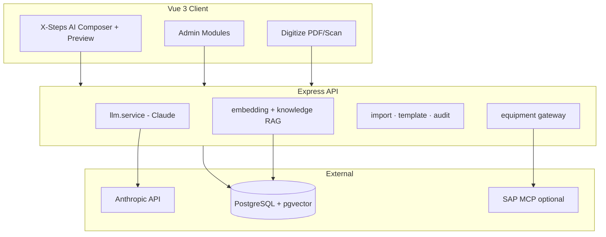

# X-Steps AI Composer

[](./LICENSE)
[](https://nodejs.org/)
[](https://vuejs.org/)
[](https://github.com/pgvector/pgvector)
[](./docker-compose.yml)

**LLM-powered Process Instruction (PI) Sheet composer for pharmaceutical manufacturing** — SAP Joule-style operator chat, GMP lifecycle workflow, XStep repository with RAG, equipment/scales Q&A, and a full admin area.

> **Pilot / demo application** — AI-generated PI sheets are **GxP drafts** and require human review and approval by Production and QA before use in manufacturing.

[Documentation (DE)](./docs/DOCUMENTATION.md) · [Documentation (EN)](./docs/DOCUMENTATION.en.md) · [Developer guide](./docs/DEV.md) · [In-app Help & Architecture (DE/EN)](./client/src/content/architectureHelp.js)

---

## What this application does

Operators describe in **natural language** which Process Instruction (PI) sheet they need. The system builds a **structured draft** from:

- A configurable **XStep repository** (manufacturing step templates with SAP transactions, GMP flags, parameters)
- Optional **document knowledge base** (SOPs, work instructions — chunked RAG via pgvector)
- Optional **live equipment data** (scales, OPC-UA/UNS namespace via SAP MCP)

Administrators maintain master data, prompts, imports, equipment, and the **GMP release workflow** (draft → in review → approved → archived).

### Main areas (like in-app help)

| Area | Purpose |
|------|---------|
| **X-Steps AI Composer (Chat)** | Natural language → PI Sheet JSON or equipment Q&A; digital & print preview; PDF export; **New conversation** resets the session |
| **PI Sheet preview** | Step cards, parameters, GMP stepper, workflow actions (submit for review, approve, archive) |
| **Digitize** | PDF/image upload → vision extraction → steps into a PI sheet |
| **Admin** | Dashboard, XStep repository, multi-format import, knowledge base, prompt config (edit / diff / test), equipment & scales, PI sheet queue, settings, audit log |

### Chat modes

| Mode | Example prompt | Result |
|------|----------------|--------|
| **PI Sheet** | *Create a PI sheet for packaging with confirmations and goods movements* | Structured PI sheet in the side preview |
| **Equipment Q&A** | *Which scales are active?* | Text answer with LLM tools (no new PI sheet) |

Quick-prompt tiles on the start screen cover typical packaging, filling, granulation, and scale questions.

---

## Architecture



**Stack:** Vue 3 · Vite · Pinia · Tailwind · i18n (DE/EN) · Express · Sequelize · JWT · Anthropic Claude · Docker Compose

---

## Features

- SAP Fiori-inspired shell (Joule-style chat UI)
- Semantic XStep search (pgvector) + keyword fallback
- Configurable system prompt with version history and admin test harness
- CSV / Excel / JSON / XML / ZIP XStep import with column mapping
- Document knowledge base (PDF, DOCX, …) for extended RAG
- Equipment configs, scale widgets, namespace search (OPC-UA / UNS / MQTT)
- GMP lifecycle on PI sheets with audit logging
- Bilingual UI (operator DE, admin EN labels configurable via i18n)

---

## Deploy (CI/CD → Docker Hub → Portainer)

On every push to `main`, GitHub Actions builds and publishes:

- `schmeckm/pi-sheet-generator-api:latest`
- `schmeckm/pi-sheet-generator-client:latest`

**Setup:** Add GitHub secrets `DOCKERHUB_USERNAME` and `DOCKERHUB_TOKEN`, then use [deploy/portainer-stack.yml](./deploy/portainer-stack.yml) in Portainer.

Full guide: **[docs/DEPLOY-PORTAINER.md](./docs/DEPLOY-PORTAINER.md)**

---

## Quick start

### Docker (demo / test)

```bash
git clone https://github.com/schmeckm/pi-sheet-generator.git
cd pi-sheet-generator
cp .env.docker.example .env
# Set ANTHROPIC_API_KEY and JWT_SECRET

docker compose --profile full up -d --build
```

| Service | URL |
|---------|-----|
| **App** | http://localhost:7004 |
| **API** | http://localhost:7000/api |

| Role | Email | Password |
|------|-------|----------|
| Admin | `admin@pisheet.local` | `admin123` |
| Prompt editor | `prompt@pisheet.local` | `prompt123` |
| Operator | `operator@pisheet.local` | `operator123` |

### Local development (hot reload)

```bash
cp .env.example .env
docker compose up -d
npm install && npm install --prefix server && npm install --prefix client
npm run db:migrate --prefix server && npm run db:seed
npm run dev
```

| Service | URL |
|---------|-----|
| **UI** | http://localhost:7002 |
| **API** | http://localhost:7000/api |

See **[docs/DEV.md](./docs/DEV.md)** for port conflicts, Docker rebuild after UI changes, and troubleshooting.

---

## Ports

| Port | Service |
|------|---------|
| 7000 | API |
| 7001 | SAP MCP (optional) |
| 7002 | Vite dev UI |
| 7003 | PostgreSQL |
| 7004 | Production UI (nginx, Docker) |

---

## Project structure

```
pi-sheet-generator/
├── client/          Vue 3 SPA (chat + admin)
├── server/          Express API, services, migrations
├── docker/          API & client images
├── docs/            Full documentation & specs
├── fixtures/        Sample CSV / test images
└── .github/         Issue templates, labels, community files
```

---

## Documentation

| Document | Content |
|----------|---------|
| [docs/DOCUMENTATION.md](./docs/DOCUMENTATION.md) | Complete guide (DE) |
| [docs/DOCUMENTATION.en.md](./docs/DOCUMENTATION.en.md) | Complete guide (EN) |
| [docs/DEV.md](./docs/DEV.md) | Ports, Docker, errors |
| [docs/specs/](./docs/specs/) | MVP, equipment, import specifications |
| [docs/playbooks/](./docs/playbooks/) | Cursor implementation playbooks |

---

## Scripts

| Command | Description |
|---------|-------------|
| `npm run dev` | API + Vite concurrently |
| `npm run docker:up` | Full stack with build |
| `npm run db:seed` | Demo users, XSteps, default prompt |
| `npm test` | Server tests |

---

## Requirements

- Node.js 20+
- Docker Desktop (PostgreSQL + pgvector, optional full stack)
- [Anthropic API key](https://console.anthropic.com/) for chat / PI generation
- Optional: OpenAI key for embeddings; SAP MCP server for live equipment

---

## License

This project is licensed under the **[MIT License](./LICENSE)** — see the file for details.

---

## Disclaimer

Not validated for production GxP use. Use only in controlled pilot environments. Always verify AI-generated content with qualified personnel before release to manufacturing.
