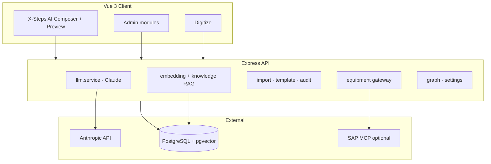

# X-Steps AI Composer — Documentation (English)

LLM-powered **X-Steps AI Composer** for Process Instruction (PI) sheets in pharmaceutical manufacturing — SAP Joule–style UI, GMP workflow, equipment/scale Q&A, and full admin area.

**Deutsch:** [DOCUMENTATION.md](./DOCUMENTATION.md)

---

## Table of contents

1. [Overview](#overview)
2. [Quick start](#quick-start)
3. [Chat & assistant](#chat--assistant)
4. [Admin area](#admin-area)
5. [Architecture](#architecture)
6. [Development & Docker](#development--docker)
7. [Environment variables](#environment-variables)
8. [Further specifications](#further-specifications)

---

## Overview

| Area | Description |
|------|-------------|
| **Chat** | Natural language → PI sheet (JSON) or equipment answers (Q&A) |
| **Preview** | PI sheet digital/print/PDF, GMP status (draft → in review → approved → archived) |
| **Repository** | Upload XSteps, digitize, semantic search (pgvector) |
| **Equipment** | Scales & devices, OPC-UA/UNS namespace, live status via SAP MCP |
| **Prompt config** | Edit system prompt, versions, diff, test with real Claude API |

**Stack:** Node.js 20, Express, Vue 3 + Vite, Pinia, PostgreSQL + pgvector, Docker Compose, Anthropic Claude.

---

## Quick start

### Docker (recommended for demo / test)

```bash
cp .env.docker.example .env
# Set ANTHROPIC_API_KEY and JWT_SECRET

docker compose --profile full up -d --build
```

| Service | URL |
|---------|-----|
| **UI** | http://localhost:7004 |
| **API** | http://localhost:7000/api |
| **PostgreSQL** | localhost:7003 |

**Demo credentials**

| Role | Email | Password |
|------|-------|----------|
| Admin | `admin@pisheet.local` | `admin123` |
| Operator | `operator@pisheet.local` | `operator123` |

### Local development (hot reload)

```bash
cp .env.example .env
docker compose up -d          # DB only (+ optional sap-mcp)
npm install && npm install --prefix server && npm install --prefix client
npm run db:migrate --prefix server
npm run db:seed
npm run dev
```

| Service | URL |
|---------|-----|
| **UI (Vite)** | http://localhost:7002 |
| **API** | http://localhost:7000/api |

Details and troubleshooting: **[DEV.md](./DEV.md)**

---

## Chat & assistant

### Start screen

When there are **no messages** in the chat:

- **Welcome** with process hints (packaging, filling, granulation, …)
- **Quick prompts** — tiles for typical PI sheet and equipment questions

Equipment examples: *“Which scales are active?”*, *“List all configured scales …”*

### Two request modes

| Mode | Typical request | Result |
|------|-----------------|--------|
| **PI Sheet** | “Create a PI sheet for packaging …” | Structured PI sheet in the right preview |
| **Equipment Q&A** | “Which scales are active?” | Text answer with tools (no new PI sheet) |

The API sets `requestMode` to `pi_sheet` or `qa` (client heuristic + server).

### New conversation (reset chat)

**Issue:** After the first message, welcome and quick prompts disappear.

**Solution:**

1. Click **“New conversation”** in the header (next to **“History”**), **or**
2. Open **“History”** → **“+ New conversation”** at the bottom

| Situation | Behavior |
|-----------|----------|
| Empty chat | Return to start screen immediately |
| With messages or response in progress | Confirmation dialog, then reset |

**Note:** Saved **PI sheets** under “History” (sidebar) remain — only the **current browser session** is cleared.

### History (PI sheets)

“History” lists **recently created PI sheets** from the database, not individual chat threads. An entry opens the sheet and related context in the preview.

### After UI code changes (Docker)

The production client is a **static nginx build**. After UI changes:

```bash
docker compose --profile full up -d --build client
```

In the browser: **Ctrl+F5** (hard refresh).

---

## Admin area

For role **ADMIN** only (Admin tab in the shell).

| Module | Function |
|--------|----------|
| **Dashboard** | Metrics and overview |
| **PI Sheets (release)** | GMP approval queue |
| **Audit log** | Change log |
| **Process graph** | XStep relationships, AI suggestions |
| **Repository** | XStep CRUD, filters, bulk actions |
| **Upload** | Multi-format import with column mapping |
| **Knowledge** | Document knowledge base, embeddings |
| **Equipment** | Devices/scales, connection test, namespace search |
| **Settings** | System settings (API keys, MCP, model, …) |
| **Prompt config** | System prompt, versions, diff, API test |
| **Help & Architecture** | In-app help (follows UI language DE/EN) |

---

## Architecture



**In-app (DE/EN):** Admin → **Help & Architecture** — follows UI language (profile/shell). Source: [`client/src/content/architectureHelp.js`](../client/src/content/architectureHelp.js).

**German documentation:** [DOCUMENTATION.md](./DOCUMENTATION.md)

**Key client paths**

| Path | Role |
|------|------|
| `client/src/views/ChatView.vue` | Chat layout, welcome, quick prompts |
| `client/src/composables/useNewChat.js` | New conversation + confirmation |
| `client/src/stores/chat.js` | Messages, generation, history |
| `client/src/components/sap/SapShell.vue` | Shell bar (new conversation, history) |
| `client/src/views/AdminHelpView.vue` | Help & architecture (i18n) |

---

## Development & Docker

### Port matrix

| Port | Service |
|------|---------|
| 7000 | API |
| 7001 | SAP MCP |
| 7002 | Vite dev UI |
| 7003 | PostgreSQL |
| 7004 | Docker UI (nginx) |

**Do not run at the same time:** local `npm run dev` (7000) and Docker `api` on 7000.

### NPM scripts (root)

| Script | Description |
|--------|-------------|
| `npm run dev` | API + Vite in parallel |
| `npm run docker:up` | Full stack with build |
| `npm run docker:down` | Stop containers |
| `npm run docker:seed` | Seed in API container |
| `npm run db:migrate` | Migrations |
| `npm run db:seed` | Demo data |

---

## Environment variables

**Templates (with comments):** [`.env.example`](../.env.example) (local), [`.env.docker.example`](../.env.docker.example) (Compose), [`deploy/.env.portainer.example`](../deploy/.env.portainer.example) (Portainer).

**Not in `.env`:** Prompt text, model, and many SAP options → **Admin → Settings** (database `system_settings`). `.env` is for infrastructure and secrets.

| Variable | Required | Description |
|----------|----------|-------------|
| `DATABASE_URL` | Yes (local) | PostgreSQL; in Compose from `docker-compose.yml` |
| `JWT_SECRET` | Yes | Login token signature; mandatory in production |
| `ANTHROPIC_API_KEY` | Yes (chat/AI) | Claude API |
| `OPENAI_API_KEY` / `EMBEDDING_API_KEY` | Optional | Vector search (RAG); else keyword fallback |
| `SAP_MCP_ENABLED` | Optional | `true` for live equipment via MCP |
| `SAP_MCP_URL` | Optional | MCP SSE URL; admin setting takes precedence |
| `VITE_API_URL` | Local | API path `/api` with Vite proxy |

**Never commit:** `.env`, API keys, `login.json`.

---

## Further specifications

| File | Topic |
|------|--------|
| [README.md](../README.md) | Short README, ports, quick start |
| [docs/README.md](./README.md) | Documentation index |
| [DEV.md](./DEV.md) | Developer guide |
| [MVP4-SPEC.md](./specs/MVP4-SPEC.md) | GMP lifecycle, release |
| [EQUIPMENT-SPEC.md](./specs/EQUIPMENT-SPEC.md) | Scales, MCP, namespace |
| [IMPORT-SPEC.md](./specs/IMPORT-SPEC.md) | Multi-format import |

---

*Status: MVP 4 — including “New conversation”, equipment Q&A, GMP workflow. In-app Help & Architecture: DE/EN via UI language.*
