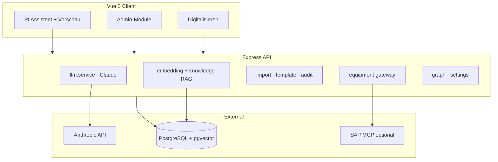

# PI Sheet Generator — Dokumentation

LLM-gestützter **Process Instruction (PI) Sheet** Generator für die pharmazeutische Fertigung mit SAP-Joule-ähnlicher Oberfläche, GMP-Workflow, Equipment-/Waagen-Q&A und Admin-Bereich.

---

**English:** [DOCUMENTATION.en.md](./DOCUMENTATION.en.md)

## Inhaltsverzeichnis

1. [Überblick](#überblick)
2. [Schnellstart](#schnellstart)
3. [Chat & Assistent](#chat--assistent)
4. [Admin-Bereich](#admin-bereich)
5. [Architektur](#architektur)
6. [Entwicklung & Docker](#entwicklung--docker)
7. [Umgebungsvariablen](#umgebungsvariablen)
8. [Weitere Spezifikationen](#weitere-spezifikationen)

---

## Überblick

| Bereich | Beschreibung |
|---------|----------------|
| **Chat** | Natürliche Sprache → PI Sheet (JSON) oder Equipment-Antworten (Q&A) |
| **Vorschau** | PI Sheet digital/druck/PDF, GMP-Status (Entwurf → Prüfung → Freigegeben → Archiv) |
| **Repository** | XSteps hochladen, digitalisieren, semantische Suche (pgvector) |
| **Equipment** | Waagen & Geräte, OPC-UA/UNS-Namespace, Live-Status via SAP MCP |
| **Prompt Config** | System-Prompt bearbeiten, Versionen, Test mit echter Claude-API |

**Technologie:** Node.js 20, Express, Vue 3 + Vite, Pinia, PostgreSQL + pgvector, Docker Compose, Anthropic Claude.

---

## Schnellstart

### Docker (empfohlen für Demo / Test)

```bash
cp .env.docker.example .env
# ANTHROPIC_API_KEY und JWT_SECRET setzen

docker compose --profile full up -d --build
```

| Dienst | URL |
|--------|-----|
| **UI** | http://localhost:7004 |
| **API** | http://localhost:7000/api |
| **PostgreSQL** | localhost:7003 |

**Demo-Zugang**

| Rolle | E-Mail | Passwort |
|-------|--------|----------|
| Admin | `admin@pisheet.local` | `admin123` |
| Operator | `operator@pisheet.local` | `operator123` |

### Lokal entwickeln (Hot-Reload)

```bash
cp .env.example .env
docker compose up -d          # nur DB (+ optional sap-mcp)
npm install && npm install --prefix server && npm install --prefix client
npm run db:migrate --prefix server
npm run db:seed
npm run dev
```

| Dienst | URL |
|--------|-----|
| **UI (Vite)** | http://localhost:7002 |
| **API** | http://localhost:7000/api |

Details und Fehlerbehebung: **[DEV.md](./DEV.md)**

---

## Chat & Assistent

### Startbildschirm

Wenn **keine Nachrichten** im Chat sind, erscheinen:

- **Begrüßung** mit Prozess-Hinweisen (Verpackung, Abfüllung, Granulation, …)
- **Quick-Prompts** — Kacheln für typische PI-Sheet- und Equipment-Fragen

Beispiele Equipment: *„Welche Waagen sind aktiv?“*, *„Liste alle konfigurierten Waagen …“*

### Zwei Anfrage-Modi

| Modus | Typische Anfrage | Ergebnis |
|-------|------------------|----------|
| **PI Sheet** | „Erstelle ein PI Sheet für Verpackung …“ | Strukturiertes PI Sheet in der rechten Vorschau |
| **Equipment Q&A** | „Welche Waagen sind aktiv?“ | Textantwort mit Tool-Nutzung (kein neues PI Sheet) |

Die API setzt `requestMode` auf `pi_sheet` oder `qa` (Client-Heuristik + Server).

### Neues Gespräch (Chat zurücksetzen)

**Problem:** Nach einer Frage verschwinden Begrüßung und Quick-Prompts.

**Lösung:**

1. In der **Kopfzeile** auf **„Neues Gespräch“** klicken (neben **„Verlauf“**), **oder**
2. **„Verlauf“** öffnen → unten **„+ Neues Gespräch“**

| Situation | Verhalten |
|-----------|-----------|
| Leerer Chat | Sofort zurück zum Startbildschirm |
| Mit Nachrichten oder laufender Antwort | Bestätigungsdialog, dann Reset |

**Hinweis:** Gespeicherte **PI Sheets** unter „Verlauf“ (Seitenleiste) bleiben erhalten — es wird nur die **aktuelle Browser-Session** geleert.

### Verlauf (PI Sheets)

„Verlauf“ listet **zuletzt erstellte PI Sheets** aus der Datenbank, nicht einzelne Chat-Threads. Ein Eintrag öffnet Sheet + zugehörigen Kontext in der Vorschau.

### Nach Code-Änderungen am UI (Docker)

Der Production-Client ist ein **statisches nginx-Build**. Nach UI-Änderungen:

```bash
docker compose --profile full up -d --build client
```

Im Browser: **Strg+F5** (Hard Refresh).

---

## Admin-Bereich

Nur für Rolle **ADMIN** (Tab „Admin“ in der Shell).

| Modul | Funktion |
|-------|----------|
| **Dashboard** | Kennzahlen und Übersicht |
| **PI Sheets** | Freigabe-Warteschlange (GMP) |
| **Audit** | Änderungsprotokoll |
| **Prozessgraph** | XStep-Beziehungen, KI-Vorschläge |
| **Repository** | XStep-Upload, Liste, Bearbeiten |
| **Upload** | Multi-Format-Import mit Mapping |
| **Knowledge** | Wissensbasis, Embeddings |
| **Equipment** | Geräte/Waagen, Verbindungstest, Namespace-Suche |
| **Einstellungen** | Systemeinstellungen (API-Keys, MCP, …) |
| **Prompt Config** | System-Prompt, Versionen, Diff, API-Test |
| **Hilfe & Architektur** | In-App-Hilfe (folgt UI-Sprache DE/EN) |

---

## Architektur



**In-App (DE/EN):** Admin → **Hilfe & Architektur** — folgt der UI-Sprache (Profil/Shell). Quelle: [`client/src/content/architectureHelp.js`](../client/src/content/architectureHelp.js).

**Englische Dokumentation:** [DOCUMENTATION.en.md](./DOCUMENTATION.en.md)

**Wichtige Client-Pfade**

| Pfad | Rolle |
|------|--------|
| `client/src/views/ChatView.vue` | Chat-Layout, Welcome, Quick-Prompts |
| `client/src/composables/useNewChat.js` | Neues Gespräch + Bestätigung |
| `client/src/stores/chat.js` | Nachrichten, Generierung, Verlauf |
| `client/src/components/sap/SapShell.vue` | Shell-Leiste (Neues Gespräch, Verlauf) |
| `client/src/views/AdminHelpView.vue` | Hilfe & Architektur (i18n) |

---

## Entwicklung & Docker

### Port-Matrix

| Port | Dienst |
|------|--------|
| 7000 | API |
| 7001 | SAP MCP |
| 7002 | Vite Dev UI |
| 7003 | PostgreSQL |
| 7004 | Docker UI (nginx) |

**Nicht gleichzeitig:** lokales `npm run dev` (7000) und Docker-`api` auf 7000.

### NPM-Skripte (Root)

| Skript | Beschreibung |
|--------|----------------|
| `npm run dev` | API + Vite parallel |
| `npm run docker:up` | Vollstack mit Build |
| `npm run docker:down` | Container stoppen |
| `npm run docker:seed` | Seed im API-Container |
| `npm run db:migrate` | Migrationen |
| `npm run db:seed` | Demo-Daten |

---

## Umgebungsvariablen

**Vorlagen (mit Kommentaren):** [`.env.example`](../.env.example) (lokal), [`.env.docker.example`](../.env.docker.example) (Compose), [`deploy/.env.portainer.example`](../deploy/.env.portainer.example) (Portainer).

**Nicht in `.env`:** Prompt-Text, Modell und viele SAP-Optionen → **Admin → Einstellungen** (Datenbank `system_settings`). `.env` ist Infrastruktur und Secrets.

| Variable | Pflicht | Beschreibung |
|----------|---------|--------------|
| `DATABASE_URL` | Ja (lokal) | PostgreSQL; in Compose aus `docker-compose.yml` |
| `DB_SSL` | Optional | `true` für verwaltetes Postgres mit SSL |
| `JWT_SECRET` | Ja | Signatur für Login-Token; in Production zwingend |
| `JWT_EXPIRES_IN` | Optional | Standard `7d` |
| `ANTHROPIC_API_KEY` | Ja (Chat/KI) | Claude API |
| `OPENAI_API_KEY` / `EMBEDDING_API_KEY` | Optional | Vektorsuche (RAG); sonst Keyword-Fallback |
| `EMBEDDING_MODEL` | Optional | Standard `text-embedding-3-small` |
| `EMBEDDING_API_URL` | Optional | Kompatibler Embeddings-Endpunkt |
| `PORT` / `NODE_ENV` | Optional | API-Port (7000), Laufzeitmodus |
| `CORS_ORIGINS` | Optional | Komma-getrennte erlaubte Origins (Compose setzt Defaults) |
| `SAP_MCP_ENABLED` | Optional | `true` für Live-Equipment über MCP |
| `SAP_MCP_URL` | Optional | MCP-SSE-URL; Admin-Setting hat Vorrang |
| `SAP_MCP_AUTH_TOKEN` | Optional | Bearer für geschützten MCP-Server |
| `AUTO_SEED` | Docker | `true` = Demo-User/XSteps beim Container-Start |
| `VITE_DEV_PORT` / `VITE_API_URL` | Lokal | Vite (7002); API-Pfad `/api` mit Proxy |

**Niemals committen:** `.env`, API-Keys, `login.json`.

---

## Weitere Spezifikationen

| Datei | Inhalt |
|-------|--------|
| [README.md](../README.md) | Kurz-README, Ports, Quick Start |
| [docs/README.md](./README.md) | Dokumentations-Index & Projektstruktur |
| [DEV.md](./DEV.md) | Entwickler-Handbuch, Fehler, Prompt Config |
| [MVP4-SPEC.md](./specs/MVP4-SPEC.md) | GMP-Lifecycle, Freigabe |
| [EQUIPMENT-SPEC.md](./specs/EQUIPMENT-SPEC.md) | Waagen, MCP, Namespace |
| [mvp3-playbook.md](./playbooks/mvp3-playbook.md) | Implementierungs-Playbook |

---

## GitHub

### Repository klonen (nach dem Push)

```bash
git clone https://github.com/<IHR-USER>/pi-sheet-generator.git
cd pi-sheet-generator
cp .env.docker.example .env
docker compose --profile full up -d --build
```

### Erstes Push (einmalig auf diesem Rechner)

Lokal ist bereits ein Commit auf `master` vorbereitet. GitHub CLI muss angemeldet sein:

```powershell
gh auth login
# GitHub.com → HTTPS → Login im Browser

gh repo create pi-sheet-generator --public --source=. --remote=origin --push `
  --description "LLM-powered PI Sheet Generator for pharmaceutical manufacturing"
```

**Alternativ** (Repo auf github.com manuell anlegen, dann):

```powershell
git remote add origin https://github.com/<IHR-USER>/pi-sheet-generator.git
git push -u origin master
```

Bei Problemen mit der UI nach Updates: Client-Image neu bauen (siehe [Chat & Assistent](#nach-code-änderungen-am-ui-docker)).

---

*Stand: MVP 4 — inkl. „Neues Gespräch“, Equipment Q&A, GMP-Workflow. Hilfe & Architektur in der App: DE/EN über UI-Sprache.*
